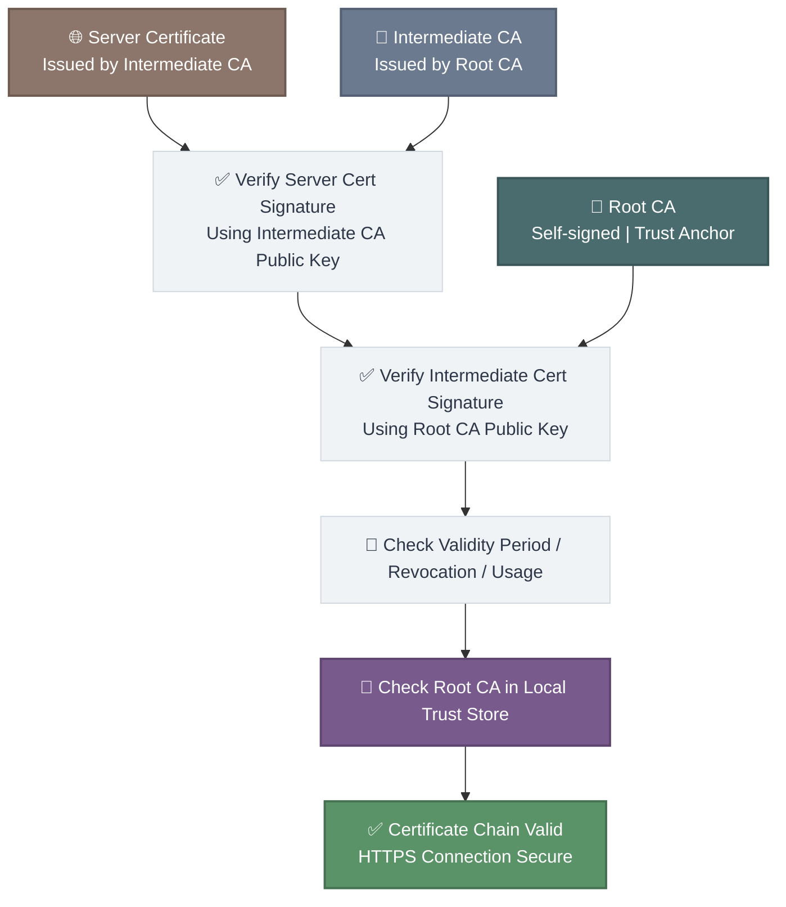
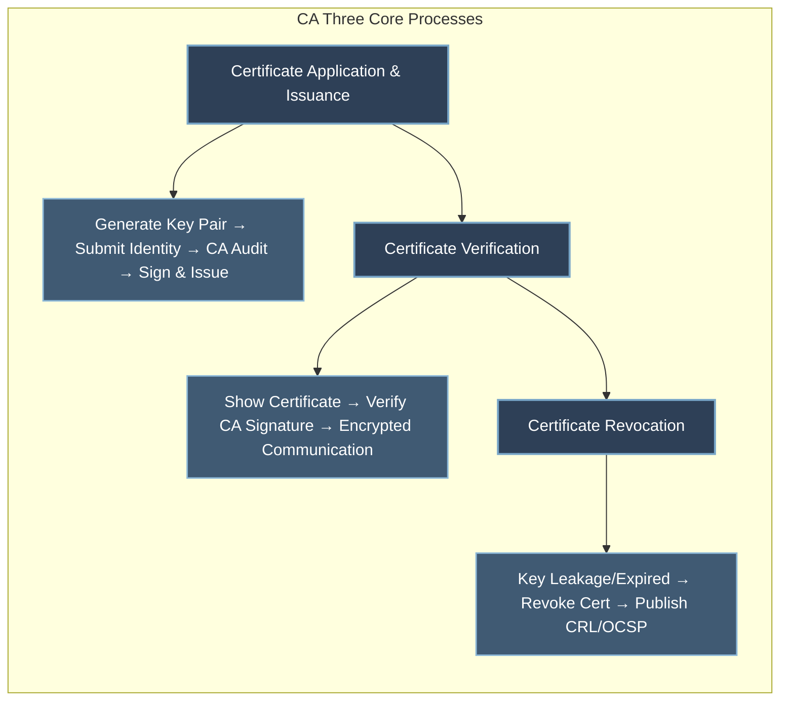
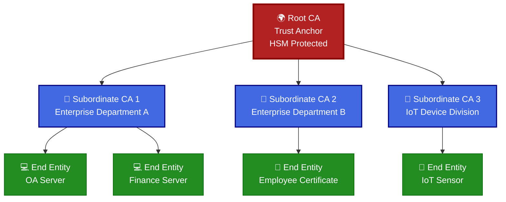
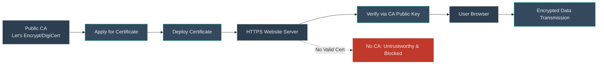
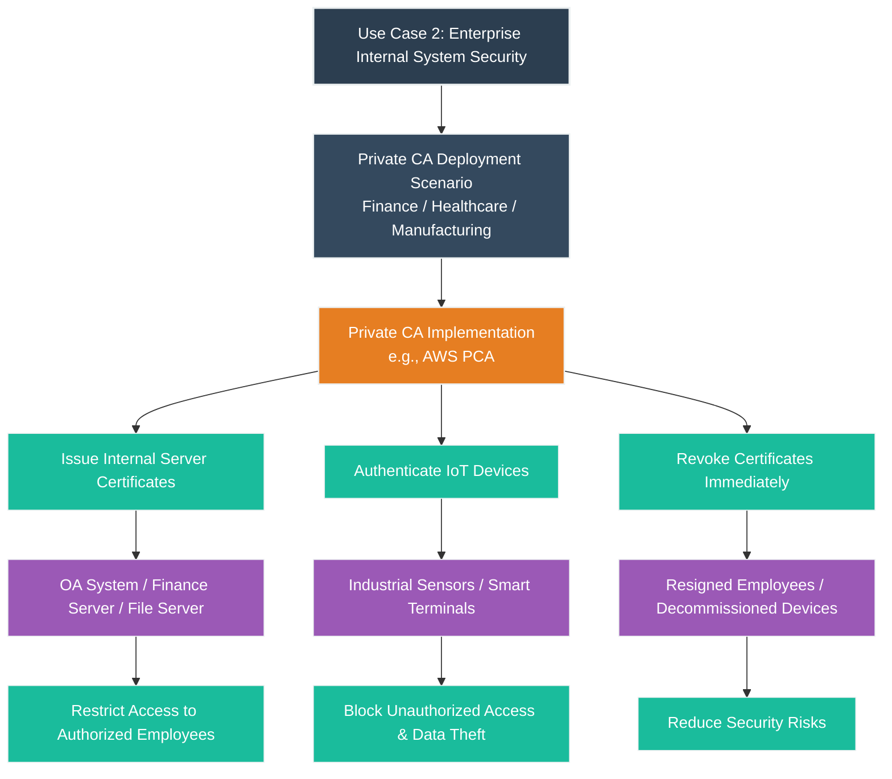
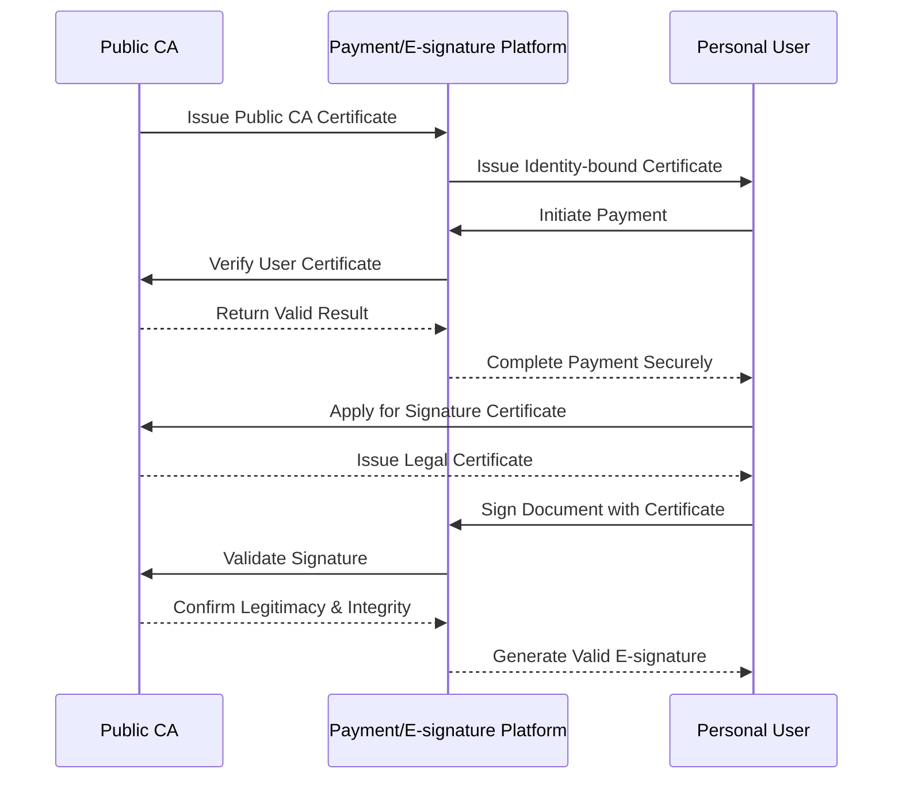

# Detailed Explanation of CA (Certificate Authority): Definition, Working Principle and Practical Use Cases
In the field of network security, CA (Certificate Authority) serves as the core infrastructure ensuring identity authentication and encrypted data transmission, acting as the **digital identity issuance authority** in the cyber world. Whether in daily web browsing, mobile payment, or internal system communication within enterprises, CA operates silently in the background to address the core issues: **how to verify the authenticity of a party’s identity** and **how to ensure data transmission is free from tampering and theft**.

Without a trusted CA, the internet would be full of counterfeit websites, stolen data, and identity fraud—users cannot distinguish between legitimate servers and phishing platforms, enterprises cannot secure internal communications, and digital transactions cannot obtain legal validity. As the cornerstone of Public Key Infrastructure (PKI), CA builds a universal trust system for cyberspace through standardized digital certificate management, asymmetric encryption technology, and a hierarchical trust mechanism.

## 1. What is a CA?

A CA is a trusted third-party authority responsible for **issuing, managing, auditing, revoking, and archiving digital certificates** in full life cycle. Its core responsibility is to strictly verify the real identity of certificate applicants (including individuals, enterprises, servers, IoT devices, applications, etc.), then bind the applicant’s identity information, public key, validity period, certificate usage scope and other core data into a digital certificate, and sign it with the CA’s private key to ensure the certificate cannot be forged or tampered with.

In short, the role of a CA is completely analogous to that of a public security bureau in the physical world:
- Public security bureaus verify citizen identity materials and issue physical identity cards to prove personal authenticity.
- CAs verify cyber entity identity materials and issue digital certificates to prove online identity legitimacy.

CAs are categorized into two core types for different application scenarios, with clear differences in usage scope, management authority and security policies:
- **Public CA**: Operated by internationally renowned third-party trusted commercial organizations (e.g., Let’s Encrypt, DigiCert, GlobalSign). Pre-installed in mainstream browsers, operating systems and mobile devices by default, serving public internet users and services. It provides free or paid digital certificates for public websites, mobile apps, SaaS platforms, etc., to secure public network communications (the most common scenario is HTTPS website encryption).
- **Private CA**: Independently built, hosted or outsourced by enterprises, government agencies, medical and financial institutions (e.g., AWS Private CA, Microsoft AD CS, OpenSSL self-built CA). Not open to the public, exclusively used for internal business systems. It manages digital certificates for internal servers, office devices, IoT terminals, employee accounts, etc., to isolate internal and external networks and meet industry compliance requirements.

## 2. Working Principle of CA
CA operations are fully built on **asymmetric cryptography** and comply with international standard **Public Key Infrastructure (PKI)** specifications. The entire working mechanism revolves around digital certificates, and is divided into three core phases: **certificate application and issuance**, **certificate verification**, and **certificate revocation**. At the same time, CAs adopt a hierarchical trust chain architecture to ensure security and scalability.

### 1. Core Foundation: Asymmetric Cryptography
All CA functions rely on asymmetric cryptography, which uses a mathematically paired **key pair (public key + private key)** to achieve encryption and signature:
- **Public key**: Publicly distributed to all users, used for encrypting data sent to the certificate holder and verifying digital signatures.
- **Private key**: Strictly kept confidential by the certificate holder, used for decrypting data encrypted with the public key and generating unique digital signatures.

This technology ensures that only the private key holder can decrypt the encrypted data, and the signature can only be generated by the private key, realizing identity verification and data anti-tampering.

### 2. Three Core Processes

#### (1) Certificate Application and Issuance
This is the starting point of the certificate life cycle, with strict audit standards:
1. The applicant generates a secure key pair locally (private key storage is critical), and submits the **public key** + formal identity materials (domain name ownership certificate, business license, employee ID, device serial number, etc.) to the CA.
2. The CA performs multi-dimensional identity verification: public CAs verify domain name ownership and enterprise qualifications; private CAs authenticate internal device/employee identities through the enterprise directory system.
3. After the audit is passed, the CA uses its **own private key** to sign the applicant’s public key, identity information, validity period and usage scope, generating a unique digital certificate.
4. The CA issues the certificate to the applicant, who deploys it on servers, devices or applications for authentication and encryption services.

#### (2) Certificate Verification
This is the core scenario for CA to play a trust role, running in real time during network communication:
1. The certificate holder (e.g., website server) actively presents its digital certificate to the visitor (e.g., user browser).
2. The visitor extracts two core contents from the certificate: the holder’s public key and the CA’s digital signature, then obtains the CA’s public key from the local trusted certificate store.
3. The visitor uses the CA’s public key to verify the signature:
   - **Verification passed**: The certificate is authentic, untampered and valid; the holder’s identity is trusted.
   - **Verification failed**: The certificate is forged, altered or expired; the visitor immediately terminates the communication (browser displays “not secure” warning).
4. After successful verification, the visitor encrypts sensitive data with the holder’s public key; only the holder’s private key can decrypt it, realizing secure encrypted communication.

#### (3) Certificate Revocation
Digital certificates are not permanently valid—they need to be revoked immediately in abnormal scenarios to avoid security risks:
- **Abnormal scenarios**: Private key leakage, certificate holder resignation/expulsion, device decommissioning, identity information change, certificate misuse.
- **Revocation release channels**:
  1. **Certificate Revocation List (CRL)**: CA regularly publishes a list of revoked certificates for visitors to query.
  2. **Online Certificate Status Protocol (OCSP)**: Real-time online query interface, supporting instant certificate validity verification with higher efficiency.

### 3. CA Hierarchical Structure (Trust Chain)

To maximize security and meet large-scale management needs, CAs adopt a **tree-like hierarchical trust structure** (trust chain), which is an industry best practice:

- **Root CA**: The top of the trust chain, the core of the entire PKI system. Its private key is stored in a **Hardware Security Module (HSM)** in an offline physical isolation environment, and only issues certificates to subordinate CAs—never directly issues end-entity certificates, completely avoiding private key exposure.
- **Subordinate CA**: Authorized by the root CA, responsible for daily certificate operations (application, review, issuance, revocation). Enterprises can deploy multiple subordinate CAs by department, region, business line or device type for refined management.
- **End Entity**: Servers, devices, employees and other objects that finally use certificates.

#### ① Design Purpose
The core goal is to achieve **hierarchical control and risk isolation** for the PKI system:
1. Protect the absolute security of the root CA private key—once leaked, the entire trust system collapses.
2. Realize fine-grained permission management—each subordinate CA only manages its own business certificates.
3. Reduce fault impact scope—if a subordinate CA is abnormal, only its internal certificates are affected, and the root CA and other subordinate CAs remain secure.
4. Meet industry compliance requirements (financial, medical, government) and follow cloud security best practices (minimize root CA usage).

#### ② Risks of Unused or Misconfigured Setup
Directly using the root CA to issue end-entity certificates will bring catastrophic risks:
1. **Root private key exposure risk surges**: Once leaked, all certificates in the system are invalid, and all TLS encrypted services are interrupted. Recovery requires rebuilding the root CA and reissuing all certificates, causing days or weeks of business downtime.
2. **Unable to control permission scope**: A single certificate compromise will affect the entire system, expanding security incident scope.
3. **Violate compliance standards**: Enterprises in finance, medical and other industries will face heavy fines and regulatory penalties.

**Case Study**: A regional commercial bank directly used the root CA to issue internal server certificates. An O&M misoperation led to root private key leakage, resulting in the paralysis of online banking, mobile banking and counter systems for 48 hours, affecting 100,000+ users and being fined millions of yuan by regulatory authorities.

## 3. Practical Use Cases of CA
CA has penetrated into all scenarios of public network services, enterprise internal management and personal digital life, with three most typical applications:

### Use Case 1: Website HTTPS Encryption (Typical Public CA Scenario)

This is the most widely used CA scenario, covering all mainstream websites (Taobao, Baidu, WeChat Official Accounts, e-commerce platforms):
1. Website operators apply for SSL/TLS certificates from public CAs (free: Let’s Encrypt; paid: DigiCert) and complete domain name verification.
2. Deploy the certificate on the web server to enable HTTPS protocol.
3. When a user visits, the browser automatically verifies the certificate authenticity through the built-in public CA public key.
4. After verification, encrypted data transmission is enabled to protect user accounts, passwords, payment information and personal data from theft or tampering.

**Value**: Without a valid public CA certificate, browsers will mark the website as “untrustworthy” and block sensitive data submission, directly affecting user trust and business operations.

### Use Case 2: Enterprise Internal System Security (Private CA Scenario)

Large enterprises, financial institutions, hospitals and manufacturing plants widely deploy private CAs to build an isolated internal trust system:
1. **Internal server authentication**: Issue certificates for OA, finance, file and database servers to restrict access to authorized employees only.
2. **IoT device security**: Authenticate industrial sensors, smart terminals and production devices to prevent unauthorized access and data leakage.
3. **Lifecycle management**: Revoke certificates immediately for resigned employees, lost devices and decommissioned servers to eliminate potential risks.
4. **Compliance implementation**: Meet industry regulations (HIPAA for medical care, PCI DSS for finance) for data security and identity authentication.

**Case Study**: A top-three hospital in China uses a private CA to encrypt medical record systems, registration systems and drug management systems, ensuring patient data privacy and passing national medical information security compliance audits.

### Use Case 3: Mobile Payment and Electronic Signature (Personal Scenario)

CA provides security and legal support for personal digital services:
1. **Mobile payment security**: Payment platforms (WeChat Pay, Alipay) obtain public CA certificates for self-authentication, and issue identity-bound certificates to users. The CA verifies the user certificate during each payment to prevent unauthorized transactions and fraud.
2. **Legal electronic signature**: CAs issue legally valid digital certificates to individuals/enterprises. Users sign electronic documents (contracts, reports, forms) with the certificate; the platform verifies the signature through the CA to confirm the signatory’s identity, signature voluntariness and document integrity. The signature has the same legal effect as a handwritten signature in accordance with the Electronic Signature Law.

**Value**: CA makes personal digital transactions and signing safe, convenient and legally protected, promoting the popularization of paperless office and digital life.

## 4. Summary
The core value of CA is to **establish a universal, verifiable and secure trust system in the virtual cyberspace**. As the cornerstone of network security, CA solves the “trust deficit” problem in digital communication through full life cycle management of digital certificates, asymmetric cryptography and hierarchical trust mechanism.

From personal web browsing, mobile payment to enterprise internal system management, industry compliance operations and IoT security, CA is an indispensable core infrastructure. With the development of digital economy, cloud computing and the Internet of Things, the application scope of CA will continue to expand, becoming a key support for global network security and digital trust.

### Key Takeaways
1. CA is the **digital identity authority** of cyberspace, divided into public CA (for internet services) and private CA (for enterprise internal use).
2. Its working principle relies on **asymmetric cryptography** and three core processes: issuance, verification and revocation.
3. The **hierarchical trust chain** is the best security practice, isolating risks and realizing refined management.
4. CA is widely used in HTTPS encryption, enterprise internal security, mobile payment and electronic signature scenarios.