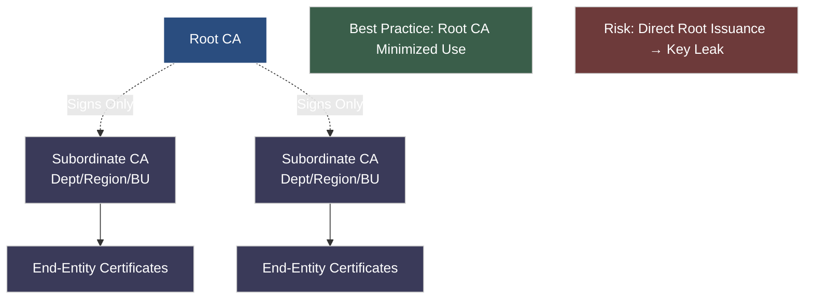
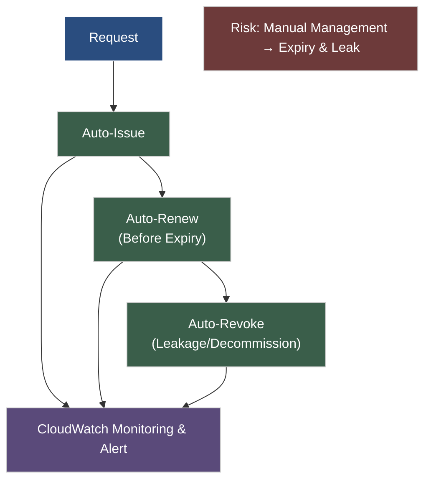
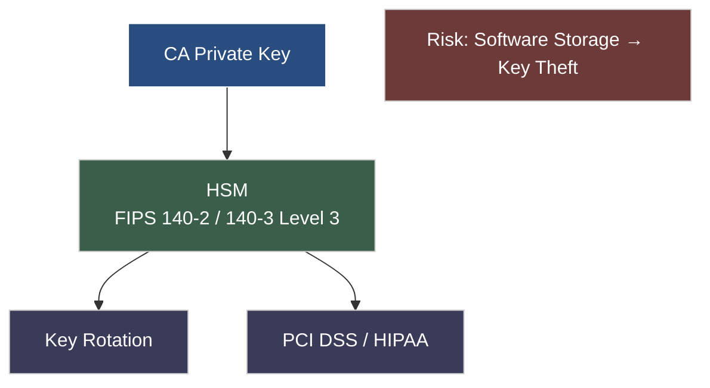
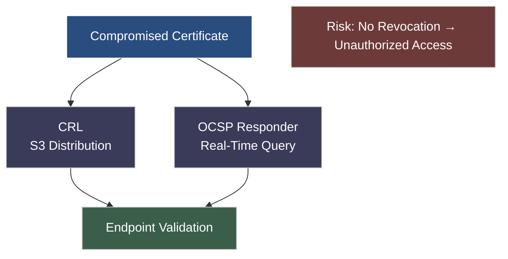
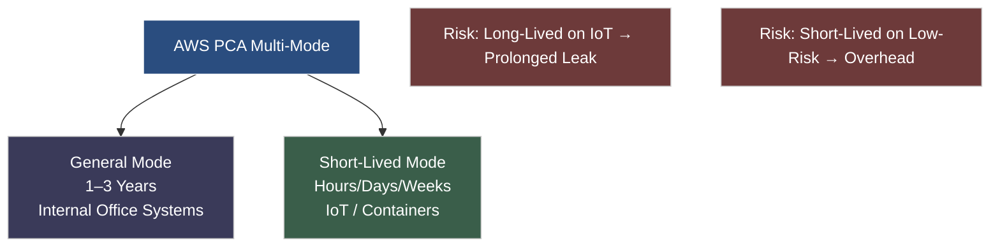
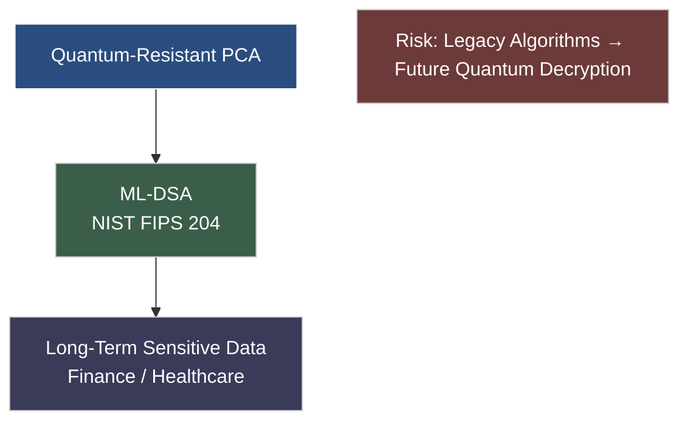

# Analysis of AWS PCA Core Functions, Use Cases, Design Purposes and Incident Risks
AWS Private Certificate Authority (AWS PCA) is a managed private certificate authority service provided by AWS. Its core value is to help enterprises build a secure, compliant and efficient private Public Key Infrastructure (PKI) without investing massive resources in building and maintaining on-premises CAs. This article breaks down its core functions one by one, combines typical use cases, clarifies the design purpose of each function and incident risks caused by improper use, and links to AWS official best practices to form a complete analysis of **Function Design – Requirement Fulfillment – Risk Mitigation**.

```mermaid
graph TD
    classDef root fill:#2a4d7f,stroke:#fff,color:#fff,stroke-width:1px
    classDef func fill:#3a3a59,stroke:#ccc,color:#fff,stroke-width:1px
    classDef risk fill:#6d3a3a,stroke:#ccc,color:#fff,stroke-width:1px
    classDef best fill:#3a5e4a,stroke:#ccc,color:#fff,stroke-width:1px

    A["AWS PCA Core Functions<br/>Use Cases & Risk Analysis"]:::root

    A --> F1["1. CA Hierarchy Management"]:::func
    A --> F2["2. Certificate Lifecycle Automation"]:::func
    A --> F3["3. Encryption Key Protection"]:::func
    A --> F4["4. Certificate Revocation"]:::func
    A --> F5["5. Multi-Mode Support"]:::func
    A --> F6["6. Quantum-Resistant Encryption"]:::func

    F1 --> D1["Design: Hierarchical Control & Risk Isolation"]:::best
    F1 --> R1["Risk: Root CA Key Leakage"]:::risk
    F2 --> D2["Design: Auto Issue/Renew/Revoke"]:::best
    F2 --> R2["Risk: Expiry & Leakage"]:::risk
    F3 --> D3["Design: FIPS 140 HSM Protection"]:::best
    F3 --> R3["Risk: Key Theft"]:::risk
    F4 --> D4["Design: CRL + OCSP"]:::best
    F4 --> R4["Risk: Unauthorized Usage"]:::risk
    F5 --> D5["Design: General + Short-Lived"]:::best
    F5 --> R5["Risk: Overexposure / Overhead"]:::risk
    F6 --> D6["Design: ML-DSA Post-Quantum"]:::best
    F6 --> R6["Risk: Future Quantum Attack"]:::risk
```

## 1. AWS PCA Core Function Breakdown (Including Design Purposes and Incident Risks)
The following core functions fully cover user requirements. Each function specifies the design purpose (aligned with AWS cloud-native, security compliance and O&M efficiency demands) and concrete incident risks (based on real scenarios), supplemented by official best practices.

### (1) CA Hierarchy Management (Root CA and Subordinate CA Separation)

#### ① Design Purpose
The core goal is to achieve **hierarchical control and risk isolation** for the PKI system, in line with AWS cloud-native security’s defense-in-depth philosophy.
As the trust root of the PKI system, the Root CA is only used to issue Subordinate CA certificates, and does not directly issue end-entity certificates (e.g., servers, devices, users). Subordinate CAs handle daily certificate issuance, renewal and other O&M operations, and can be split by business needs (department, region, business line).
This design protects the absolute security of the Root CA, enables fine-grained certificate management, reduces the impact of a single CA failure on the entire system, meets enterprise compliance requirements for PKI hierarchical control (e.g., financial and healthcare industry standards), and follows AWS’s official best practice of **minimizing Root CA usage**.

#### ② Incident Risks of Unused or Misconfigured Setup
Without separating Root CA and Subordinate CA, and directly using the Root CA to issue all end-entity certificates, two major risks arise:
- First, the exposure probability of the Root CA private key increases sharply. Once leaked, the entire PKI trust foundation collapses, all issued certificates become invalid, and all certificate-dependent internal services (TLS communication, device authentication) are fully interrupted. Recovery requires rebuilding the Root CA and reissuing all certificates, potentially causing days or weeks of downtime.
- Second, fine-grained permission control becomes impossible. If a certificate in one business line is compromised (e.g., key leakage), the entire system is affected instead of just that line, expanding the incident scope.

**Example**: A financial institution directly used its Root CA to issue end-server certificates against AWS best practices. A misoperation by an O&M engineer leaked the Root CA private key, disabling TLS encryption for online and mobile banking, blocking user logins and transactions for 48 hours. The company was heavily fined for violating PKI hierarchical control rules.
In addition, not deploying the Root CA in a standalone AWS account (AWS-recommended best practice) places Root CA and Subordinate CA within the same permission boundary, increasing risks of malicious or accidental operations.

### (2) Automated Certificate Lifecycle (Auto-Issuance, Renewal, Revocation)

#### ① Design Purpose
Solves the inefficiency and error-prone nature of traditional manual certificate management, aligning with AWS cloud-native automated O&M.
Traditional PKI relies on manual issuance, renewal and revocation, consuming heavy O&M resources and leading to issues such as expired certificates and unrevoked compromised keys.
AWS PCA automates the full lifecycle via API, CLI or CloudFormation:
- Auto-issue certificates based on rules (e.g., device onboarding)
- Auto-renew before expiration (configurable threshold, e.g., 30 days)
- Auto-revoke on triggers (key leakage, device decommissioning)
Automation integrates with Amazon CloudWatch for real-time monitoring and alerting, greatly improving O&M efficiency and avoiding service outages from human error.

#### ② Incident Risks of Unused or Misconfigured Setup
Reliance on manual management leads to two high-frequency incidents:
- **Certificate expiration causing outages**: For example, an Internet company without auto-renewal suffered a 6-hour outage when core server TLS certificates expired, resulting in user churn and financial loss — similar to the 2026 *League of Legends* global downtime caused by an unrenewed SSL certificate.
- **Unrevoked compromised certificates**: Attackers use invalid certificates to impersonate identities, access internal networks and steal sensitive data.

**Example**: An e-commerce company without auto-revocation suffered a logistics server certificate key leak. The compromised certificate was not manually revoked in time, allowing attackers to impersonate the server, access the internal database, and steal millions of user addresses and phone numbers, leading to complaints, regulatory investigations, penalties and reputational damage.
Without CloudWatch alerts, automation may fail silently without detection.

### (3) Encryption Key Protection (FIPS 140-2 Hardware Protection)

#### ① Design Purpose
Ensures absolute security of CA and certificate private keys and meets compliance requirements, following AWS’s hardware-level protection philosophy.
AWS PCA uses **FIPS 140-2 certified Hardware Security Modules (HSMs)** to store and protect CA private keys. HSMs provide physical isolation, tamper resistance and anti-theft capabilities, preventing unauthorized access, copying or leakage.
HSMs also support key rotation, reducing long-term key risks and satisfying strict compliance (PCI DSS, HIPAA) for finance, healthcare and government. AWS PCA now supports **FIPS 140-3 Level 3** encryption modules for enhanced protection.

#### ② Incident Risks of Unused or Misconfigured Setup
Storing keys on ordinary servers or software without FIPS 140-2 hardware protection drastically increases leakage risks:
- Keys are vulnerable to theft via vulnerabilities, allowing attackers to forge certificates and infiltrate internal networks.
- Non-compliance leads to regulatory penalties and failed audits for regulated industries.

**Example**: A healthcare company stored CA private keys on unhardened EC2 instances instead of using FIPS 140-2 protection. Hackers exploited unpatched vulnerabilities to steal keys, forged medical device certificates, accessed clinical systems, tampered with patient records and falsified reports. The hospital was fined $1.2 million for HIPAA violations and suffered severe reputational harm.

### (4) Certificate Revocation Mechanisms (CRL Distribution, OCSP Responder)

#### ① Design Purpose
Solves the problem of **unable to notify endpoints promptly when certificates become invalid**, ensuring dynamic PKI security and compliance.
When certificates are compromised, decommissioned or permission-revoked, revocation must be communicated to endpoints to prevent abuse.
AWS PCA provides two fully managed revocation mechanisms:
- **Certificate Revocation List (CRL)**: Periodically generated list of revoked certificates for offline validation.
- **Online Certificate Status Protocol (OCSP) Responder**: Real-time certificate status query.
They can be used separately or together (OCSP for real time, CRL for offline). CRLs and logs are stored in S3, following AWS best practices for **managed revocation**.

#### ② Incident Risks of Unused or Misconfigured Setup
Missing or misconfigured CRL/OCSP leads to **revoked certificates still being trusted**:
- Attackers use revoked certificates to access internal systems and steal data.
- Improper CRL configuration (delayed updates, bucket errors) prevents endpoints from receiving latest revocation data.

**Note**: Per AWS best practices, even short-lived certificates require revocation mechanisms to limit exposure during their validity period. Cross-account RAM permissions are required for cross-account revocation.
OCSP may take up to 60 minutes to reflect new statuses; CRLs typically update within 30 minutes. Unplanned delays create short windows of risk.

### (5) Multi-Mode Support (General Mode, Short-Lived Certificate Mode)

#### ① Design Purpose
Adapts to diverse business scenarios and balances **security and efficiency**, consistent with AWS cloud-native elasticity.
- **General Mode**: For long-lived certificates (1–3 years), moderate security (e.g., internal office systems), reducing O&M overhead.
- **Short-Lived Mode**: For short validity (hours, days, weeks), high-security scenarios (IoT, temporary access, containers). Even if leaked, certificates expire quickly, limiting risk.
This design allows flexible selection and reduces revocation needs for short-lived certificates.

#### ② Incident Risks of Unused or Misconfigured Setup
Mismatched modes lead to either security risks or excess O&M cost:
- High-security scenarios (IoT) using long-lived certificates: Leaked keys can be abused for years, enabling persistent access and control.
- Low-risk systems (internal office) using short-lived certificates: Frequent renewal wastes resources and risks outages.

**Example**: A smart home appliance company used 2-year general certificates for IoT devices instead of short-lived ones. Hackers stole mass certificates, accessed the IoT platform, controlled user devices and stole data. The vulnerability existed for 6 months, affecting millions of users and resulting in heavy compensation and penalties.

### (6) Quantum-Resistant Encryption (ML-DSA Algorithm Support)

#### ① Design Purpose
Mitigates future quantum computing threats and ensures long-term PKI security, supporting AWS’s **forward-looking security defense**.
Traditional RSA and ECDSA will be broken by quantum computers, invalidating existing certificates.
AWS PCA supports **ML-DSA (Module Lattice-based Digital Signature Algorithm)**, a post-quantum cryptography algorithm standardized by NIST (FIPS 204), resistant to quantum attacks.
Enabling this feature allows CAs to issue ML-DSA certificates, helping enterprises transition to post-quantum PKI and protect long-term stored sensitive data (financial transactions, medical records). Available in all commercial, GovCloud and China AWS Regions.

#### ② Incident Risks of Unused or Misconfigured Setup
Without quantum-resistant encryption, enterprises face **future quantum security risks**:
- Long-term sensitive data protected by legacy algorithms may be decrypted by quantum computers, causing historical data leaks.
- Delayed transition leads to massive future certificate and algorithm replacement costs and potential business interruptions.

**Example**: A financial institution used AWS PCA certificates to encrypt and store customer transaction data without ML-DSA. Within 5–10 years, quantum computing could expose billions of records, leading to fraud and leaks. Massive rework would be required to replace all certificates and algorithms.
