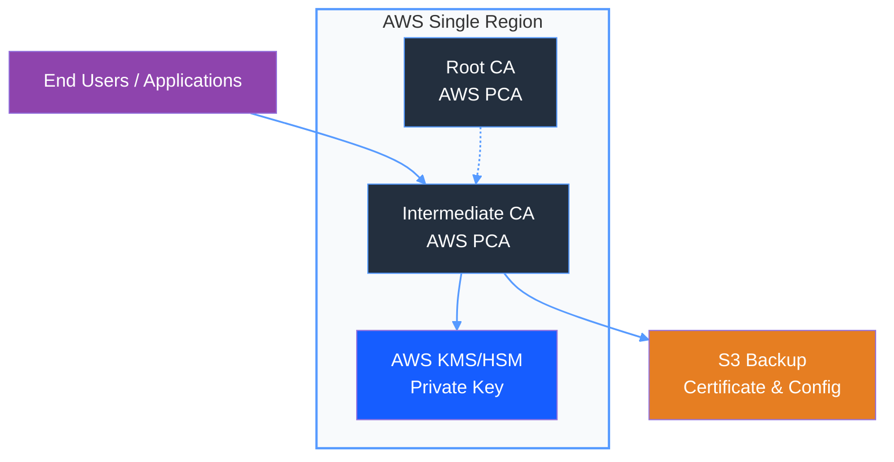

# AWS PCA vs  Traditional Enterprise On-Prem CA SLA Comparison
| Metric | AWS Private CA | Traditional / On-Prem Enterprise CA |
|--------|---------------|----------------------|
| Official SLA Commitment | 99.9% | No formal SLA, internal ~99.0%–99.5% |
| Permissible Monthly Downtime | ~43 minutes | ~3.5–7 hours |
| Permissible Annual Downtime | ~8.8 hours | ~44–88 hours |
| Service Level Failure Compensation | 10%–100% service credit | No compensation |
| High Availability Architecture | Multi-AZ automatic redundancy | Manual deployment of primary/standby or clusters required |
| Maintenance & Upgrades | Zero-downtime rolling updates | Planned maintenance windows required |
| AZ Failure | Automatic failover, minute-level RTO | Manual failover, hour-level RTO |
| Region Failure | Service unavailable, awaiting AWS recovery | Fully unavailable, no cross-region disaster recovery |
| Key Security | AWS managed HSM | Self-managed HSM or software storage, high risk |
| Operational Manpower | No dedicated PKI team required | Dedicated staff for operation and incident response required |
| Compliance | Native SOC, PCI, FedRAMP | Independent auditing and hardening required |

# AWS PCA Single Region Disaster Recovery Solution
## 1. Architecture Overview
- All Root CA / Subordinate CA instances deployed in a **single AWS Region**
- Relies on PCA native Multi-AZ high availability; no cross-region CA redundancy

## 2. Availability Guarantees
- AZ failure: Automatic failover, RTO in minutes, RPO=0
- Region failure: Service unavailable; awaiting AWS restoration

## 3. Backup Measures
- Regular export of CA certificates, certificate chains, and configuration
- Backup files stored in encrypted S3 buckets
- Enable S3 Cross-Region Replication for offsite backup redundancy

## 4. Recovery Process
1. After Region recovery: PCA automatically resumes operation with no manual intervention
2. For rebuild scenarios: Create new CA in target Region → import backed-up certificates and configurations
3. Certificate trust chain remains unchanged; no need to redistribute root certificates

## 5. RPO / RTO
- RPO: 0 (no data loss)
- RTO: Minutes for AZ failure; hours or more for Region failure

## 6. Risks
- Certificate issuance, revocation, and renewal unavailable during Region-level outage
- No automatic cross-region failover capability

# AWS PCA Single Region Backup Solution
## 1. Backup Contents
- CA certificate
- CA certificate chain
- CA configuration (templates, policies, CRL settings, etc.)
- Certificate Revocation Lists (CRL)

## 2. Backup Procedures
## 3. Storage Method
- Encrypted S3 storage (SSE-KMS)
- S3 Versioning enabled
- S3 Cross-Region Replication enabled to a secondary Region

## 4. Recovery Method
1. Create a new CA in the target Region
2. Import certificate chain
3. Restore policies, tags, and CRL configuration

## 5. RPO / RTO
- RPO: Depends on backup frequency (daily backup recommended)
- RTO: Rebuild + import ≈ 10–30 minutes

## 6. Limitations
- CA private keys cannot be exported; secured by AWS HSM
- Backups only restore certificate structure; key material cannot be migrated

---

### AWS Reference Links
- [AWS Private Certificate Service (PCA) Documentation](https://docs.aws.amazon.com/privateca/)
- [AWS Private CA SLA](https://aws.amazon.com/private-ca/sla/)
- [Backing Up and Restoring a Private CA](https://docs.aws.amazon.com/privateca/latest/userguide/backup-restore.html)
- [Amazon S3 Disaster Recovery](https://docs.aws.amazon.com/AmazonS3/latest/userguide/disaster-recovery.html)
- [AWS Key Management Service (KMS)](https://docs.aws.amazon.com/kms/)