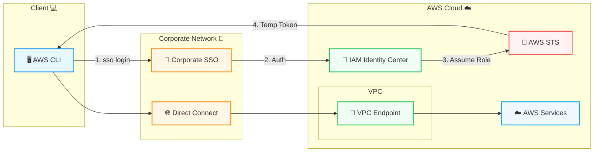

```mermaid
flowchart LR
    classDef client fill:#e6f7ff,stroke:#1890ff,stroke-width:2px,rounded:true
    classDef corp fill:#fff7e6,stroke:#fa8c16,stroke-width:2px,rounded:true
    classDef aws fill:#f0fdf4,stroke:#22c55e,stroke-width:2px,rounded:true
    classDef service fill:#f0f9ff,stroke:#0ea5e9,stroke-width:2px,rounded:true
    classDef sec fill:#fef2f2,stroke:#ef4444,stroke-width:2px,rounded:true

    subgraph "Client 💻"
        CLI["🖥️ AWS CLI"]:::client
    end

    subgraph "Corporate Network 🏢"
        DX["🌐 Direct Connect"]:::corp
        IDP["🔐 Corporate SSO"]:::corp
    end

    subgraph "AWS Cloud ☁️"
        subgraph VPC
            VPCE["📡 VPC Endpoint"]:::aws
        end
        IAMIC["👥 IAM Identity Center"]:::aws
        STS["🎫 AWS STS"]:::sec
        SVC["☁️ AWS Services"]:::service
    end

    CLI -->|"1. sso login"| IDP
    IDP -->|"2. Auth"| IAMIC
    IAMIC -->|"3. Assume Role"| STS
    STS -->|"4. Temp Token"| CLI

    CLI --> DX
    DX --> VPCE
    VPCE --> SVC
```