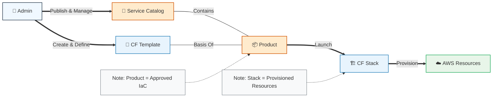

A Service Catalog is an enterprise-level management tool that allows organizations to create, manage, and govern a curated list of IT services. These services can range from simple virtual machines and software to complex, multi-tier application architectures.

The primary goal is to achieve Self-Service Provisioning while maintaining strict compliance and budget control.

1. Key Concepts
Products: A blueprint for an IT service (e.g., a "Standardized SQL Database").

Portfolios: A collection of products, managed as a single unit to control user access.

Constraints: Rules applied to products to limit how they are deployed (e.g., restricting deployment to a specific region or defining a maximum instance size).

Provisioned Products: The actual live instances created from a product template.

2. Service Catalog vs. CloudFormation
The relationship between the two is a Provider-Consumer dynamic.

CloudFormation (The Engine): It is the Infrastructure as Code (IaC) tool that defines the technical details of the resources. It focuses on how to build the infrastructure.

Service Catalog (The Storefront): It uses CloudFormation templates as its underlying "definition." It focuses on who can launch the infrastructure and under what conditions.

---

# AWS CloudFormation & Service Catalog (English Introduction)
## What is AWS CloudFormation
AWS CloudFormation is an **infrastructure-as-code (IaC)** service that allows you to model, provision, and manage AWS and third-party resources in a safe, repeatable way.

Instead of manually creating resources through the console or CLI, you define your entire infrastructure in a **template** (JSON/YAML). CloudFormation then handles the creation, update, and deletion of resources in an orderly, automated manner. Key benefits include:
- Consistent environment deployment
- Version control for infrastructure
- Automated dependency management
- Rollback on failure
- Centralized stack management

## What is AWS Service Catalog
AWS Service Catalog acts as a **governance layer** on top of CloudFormation. It lets organizations create and manage **approved catalogs of IT services** (e.g., EC2 instances, databases, VPCs, application stacks) that end users can safely deploy.

It ensures compliance, cost control, and standardization by restricting users to pre-vetted, CloudFormation-backed products.

## Relationship Between CloudFormation & Service Catalog
Service Catalog **relies entirely on CloudFormation** as its underlying engine.
- A Service Catalog **Product** is built from a CloudFormation template.
- When a user launches a product, Service Catalog triggers CloudFormation to create a **Stack**.
- CloudFormation provisions the actual resources; Service Catalog manages access, approval, and versioning.

---

# Mermaid Diagram: CloudFormation & Service Catalog Relationship

---

If you want a more detailed architecture diagram (with portfolios, versions, constraints, and IAM), just let me know and I’ll refine it.