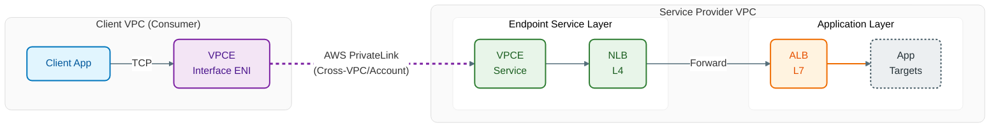

### VPCE SVC

```mermaid
%%{init: {'theme': 'base', 'themeVariables': {
    'primaryColor': '#E3F2FD',
    'edgeLabelBackground':'#ffffff',
    'tertiaryColor': '#fff'
}, 'flowchart': {'nodeSpacing': 50, 'rankSpacing': 70}}}%%

graph LR
    subgraph ClientVPC ["Client VPC (Consumer)"]
        direction LR
        A[Client App] -->|TCP| B[VPCE\nInterface ENI]
    end

    %% AWS PrivateLink Channel
    B == "AWS PrivateLink\n(Cross-VPC/Account)" ==> C

    subgraph ProviderVPC ["Service Provider VPC"]
        direction LR
        
        subgraph SvcLayer ["Endpoint Service Layer"]
            direction TB
            C[VPCE\nService] --> D[NLB\nL4]
        end

        subgraph AppLayer ["Application Layer"]
            direction TB
            E[ALB\nL7] --> F[App\nTargets]
        end
        
        %% Connection between layers
        D -->|Forward| E
    end

    %% --- Modern Styling ---
    %% Node Defaults
    linkStyle default stroke:#546E7A,stroke-width:1.5px,fill:none;
    %% Custom Node Colors
    classDef clientNode fill:#E1F5FE,stroke:#0277BD,stroke-width:2px,color:#01579B,rx:8,ry:8;
    classDef vpceNode fill:#F3E5F5,stroke:#7B1FA2,stroke-width:2px,color:#4A148C,rx:8,ry:8;
    classDef svcNode fill:#E8F5E9,stroke:#2E7D32,stroke-width:2px,color:#1B5E20,rx:8,ry:8;
    classDef albNode fill:#FFF3E0,stroke:#EF6C00,stroke-width:2px,color:#E65100,rx:8,ry:8;
    classDef targetNode fill:#ECEFF1,stroke:#455A64,stroke-width:2px,color:#263238,stroke-dasharray: 3 3,rx:8,ry:8;

    %% Assign Classes
    class A clientNode;
    class B vpceNode;
    class C,D svcNode;
    class E albNode;
    class F targetNode;

    %% Subgraph Styling
    style ClientVPC fill:#fafafa,stroke:#ddd,stroke-width:1px,rx:10,ry:10,color:#333;
    style ProviderVPC fill:#fafafa,stroke:#ddd,stroke-width:1px,rx:10,ry:10,color:#333;
    style SvcLayer fill:#fff,stroke:#eee,stroke-width:1px,rx:8,ry:8;
    style AppLayer fill:#fff,stroke:#eee,stroke-width:1px,rx:8,ry:8;

    %% Thicker connecting line for PrivateLink
    linkStyle 1 stroke:#7B1FA2,stroke-width:3px,stroke-dasharray: 5 5;
    linkStyle 3 stroke:#EF6C00,stroke-width:2px;
```