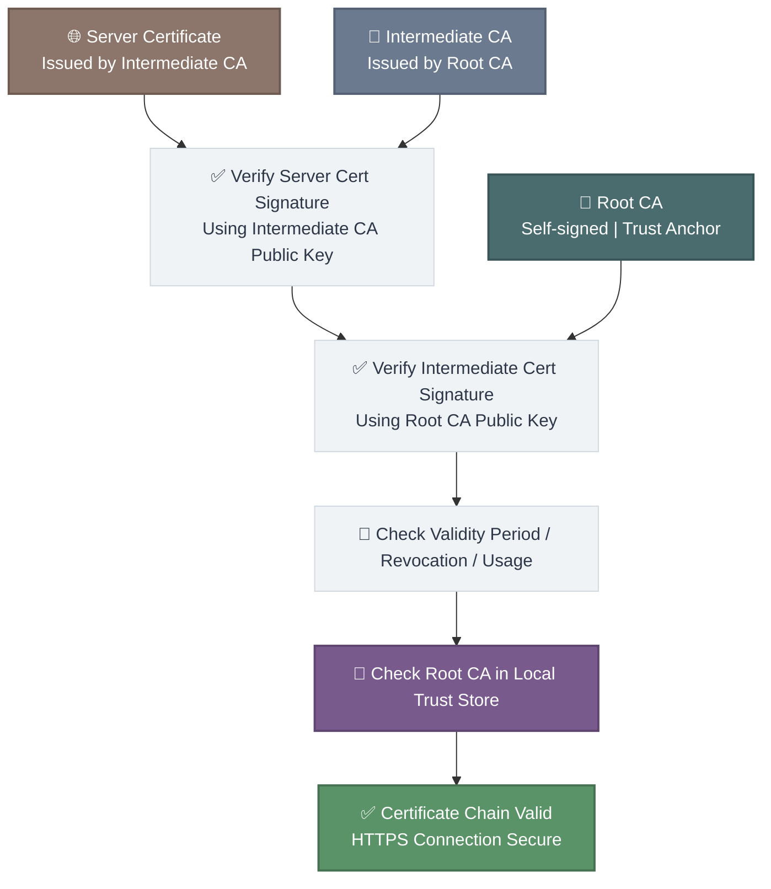
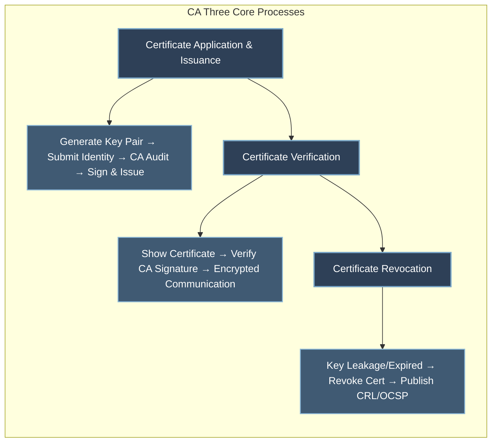

# Detailed Explanation of CA (Certificate Authority): Definition, Working Principle and Practical Use Cases
In the field of network security, CA (Certificate Authority) serves as the core infrastructure ensuring identity authentication and encrypted data transmission, acting as the **digital identity issuance authority** in the cyber world. Whether in daily web browsing, mobile payment, or internal system communication within enterprises, CA operates silently in the background to address the core issues: **how to verify the authenticity of a party’s identity** and **how to ensure data transmission is free from tampering and theft**.

## 1. What is a CA?

A CA is a trusted authority responsible for **issuing, managing, and revoking digital certificates**. Its core responsibility is to verify the real identity of certificate applicants (e.g., individuals, enterprises, servers) and issue digital certificates containing identity information, public keys, validity periods, etc., thereby establishing trust relationships in cyberspace.

In short, the role of a CA is analogous to that of a public security bureau in the physical world:
- Public security bureaus issue identity cards to citizens to prove their authenticity.
- CAs issue digital certificates to cyber entities (individuals, servers, devices) to verify their identities online.

CAs are categorized into two types for different scenarios:
- **Public CA**: Operated by third-party trusted authorities (e.g., Let’s Encrypt, DigiCert, Symantec) for the public and Internet services. They provide free or paid certificates for websites, apps, etc., to secure public network communications (e.g., HTTPS websites).
- **Private CA**: Built or hosted by enterprises or organizations (e.g., AWS PCA, Microsoft AD CS) exclusively for internal use. It manages digital certificates for internal servers, devices, and employees to safeguard internal network security (e.g., enterprise OA systems, IoT device communication).

## 2. Working Principle of CA
CA operations revolve around **digital certificates** and comply with the **Public Key Infrastructure (PKI)** system. The core workflow consists of three phases: **certificate application and issuance**, **certificate verification**, and **certificate revocation**, all based on **asymmetric cryptography (public + private key)** to ensure verifiable identities and encrypted data.

### 1. Core Foundation: Asymmetric Cryptography
Asymmetric cryptography uses a **key pair (public key + private key)** that is mathematically linked:
- The **public key** is publicly distributed for data encryption and signature verification.
- The **private key** is kept confidential for data decryption and signature generation.
All CA functions rely on this technology.

### 2. Three Core Processes

#### (1) Certificate Application and Issuance
1. The applicant (e.g., website operator, enterprise device) generates a key pair and submits the **public key** and identity information (e.g., business license, server domain) to the CA.
2. The CA performs strict identity verification (public CAs validate domain ownership and enterprise qualifications; private CAs authenticate internal devices/employees).
3. Upon approval, the CA signs the applicant’s public key, identity details, and validity period with its **own private key** to generate a digital certificate.
4. The CA issues the certificate to the applicant, who deploys it on servers or devices for authentication and encryption.

#### (2) Certificate Verification
During communication between two cyber entities (e.g., browser and website):
1. Party A (e.g., website) presents its digital certificate to Party B (e.g., browser).
2. Party B extracts the CA signature and Party A’s public key from the certificate, then obtains the CA’s public key via public channels.
3. Party B verifies the CA signature using the CA’s public key:
   - **Verification passed**: The certificate is authentic and untampered; Party A’s identity is trusted.
   - **Verification failed**: The certificate may be forged or altered; Party B terminates communication (e.g., browser “not secure” warning).
4. After successful verification, Party B encrypts data with Party A’s public key; Party A decrypts it with its private key for secure communication.

#### (3) Certificate Revocation
Digital certificates have a validity period (typically 1–3 years, short-lived certificates down to hours). If exceptions occur (e.g., private key leakage, identity change, device decommissioning), the CA revokes the certificate and publishes updates via:
- **Certificate Revocation List (CRL)**
- **Online Certificate Status Protocol (OCSP)** responders

### 3. CA Hierarchical Structure (Trust Chain)
For enhanced security and scalability, CAs adopt a hierarchical design:
- **Root CA**: The top of the trust chain, with private keys protected by **Hardware Security Modules (HSM)**. It only issues certificates to subordinate CAs, minimizing private key exposure risks.
- **Subordinate CA**: Authorized by the root CA to handle daily certificate application, review, issuance, and revocation. Multiple subordinate CAs can be deployed for refined management by department, region, or business line.

This structure mirrors a national administrative hierarchy (state → province → city), ensuring authoritative trust and efficient management.

## 3. Practical Use Cases of CA
### Use Case 1: Website HTTPS Encryption (Typical Public CA Scenario)
HTTPS-enabled websites (Taobao, Baidu, WeChat Official Accounts) rely on CAs:
- Website operators apply for certificates from public CAs (Let’s Encrypt, DigiCert) and deploy them on servers.
- Browsers verify certificate authenticity via the CA’s public key to confirm legitimate websites and prevent phishing.
- Encrypted communication via key pairs protects sensitive data (account passwords, payment info) from theft or tampering.

Without CAs, browsers would flag websites as untrustworthy, blocking sensitive data submission.

### Use Case 2: Enterprise Internal System Security (Private CA Scenario)
Large enterprises (finance, healthcare, manufacturing) deploy private CAs (e.g., AWS PCA):
- Issue certificates for internal OA, finance, and file servers to restrict access to authorized employees.
- Authenticate IoT devices (industrial sensors, smart terminals) to block unauthorized access and data theft.
- Revoke certificates immediately for resigned employees or decommissioned devices to reduce risks.

Example: Hospitals use private CAs to secure medical systems and patient data, complying with HIPAA requirements.

### Use Case 3: Mobile Payment and Electronic Signature (Personal Scenario)
CA supports WeChat/Alipay payments and legally valid electronic signatures:
- Payment platforms obtain public CA certificates for self-authentication and issue terminal certificates bound to user identities.
- Certificates verify user identity during payments to prevent unauthorized transactions.
- In electronic signing, CAs issue certificates to signatories; signatures are validated via CAs to ensure voluntariness and integrity, meeting legal requirements (e.g., Electronic Signature Law).

## 4. Summary
The core value of CA is to **establish cyber trust**. In the virtual online environment, CAs solve the “trust deficit” by issuing, verifying, and managing digital certificates, forming the foundation of network security. CA is indispensable for personal web browsing, mobile payments, and enterprise internal management and compliance operations.