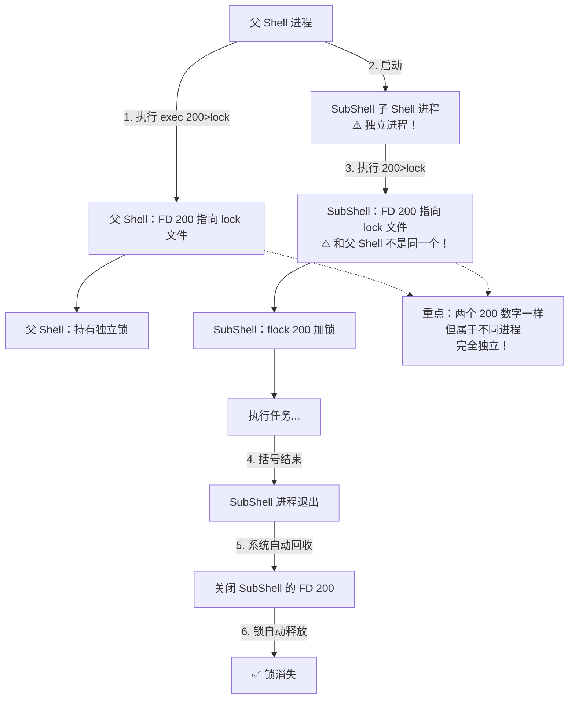

```mermaid
graph TD
    A[父 Shell 进程] -->|1. 执行 exec 200>lock| B[父 Shell：FD 200 指向 lock 文件]
    B --> C[父 Shell：持有独立锁]

    A -->|2. 启动 | D[SubShell 子 Shell 进程<br/>⚠️ 独立进程！]
    D -->|3. 执行 200>lock| E[SubShell：FD 200 指向 lock 文件<br/>⚠️ 和父 Shell 不是同一个！]
    E --> F[SubShell：flock 200 加锁]
    F --> G[执行任务...]
    G -->|4. 括号结束| H[SubShell 进程退出]
    H -->|5. 系统自动回收| I[关闭 SubShell 的 FD 200]
    I -->|6. 锁自动释放| J[✅ 锁消失]

    note1[重点：两个 200 数字一样<br/>但属于不同进程<br/>完全独立！]
    B -.-> note1
    E -.-> note1

```