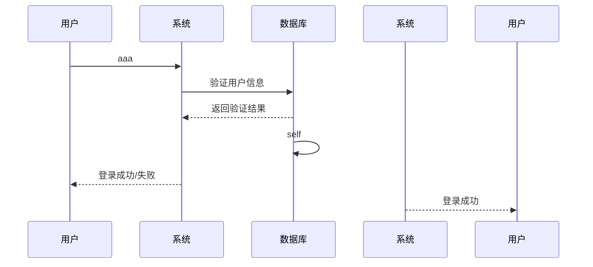
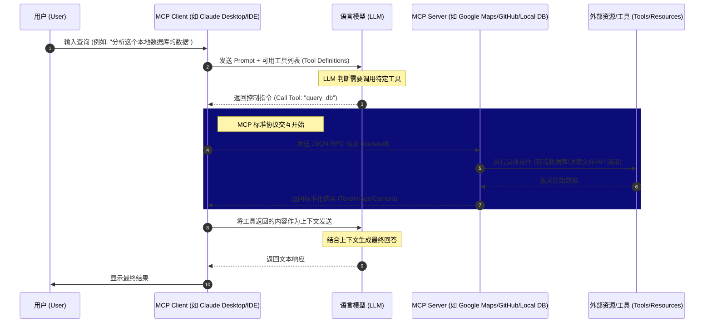

- [ ] test
- [ ] test
- [ ] test

sdfasd

| a    | b    | c     |       |
|:-----|:-----|:------|:------|
| asdf | 2    | 3     |       |
|      | 3242 | 23423 | 23432 |

asdf adasdf asds2asd
as

df dfasdf asds2 v d
asdf dfasdf asds2