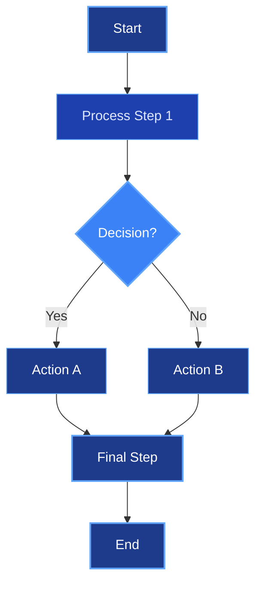

```mermaid
%%{init: {
  "theme": "dark",
  "themeVariables": {
    "primaryColor": "#1e3a8a",
    "primaryTextColor": "#ffffff",
    "primaryBorderColor": "#60a5fa",
    "lineColor": "#93c5fd",
    "textColor": "#f1f5f9",
    "fontSize": "15px",
    "fontFamily": "-apple-system, BlinkMacSystemFont, 'Segoe UI', Roboto, sans-serif",
    "background": "#0f172a",
    "nodeBorder": "#60a5fa",
    "clusterBkg": "#1e293b",
    "clusterBorder": "#3b82f6",
    "mainBkg": "#1e3a8a",
    "nodeTextColor": "#ffffff"
  }
}}%%

flowchart TD
    %% 强制覆盖节点样式（关键修复）
    classDef startNode fill:#1e3a8a,stroke:#60a5fa,stroke-width:2px,color:#ffffff;
    classDef processNode fill:#1e40af,stroke:#60a5fa,stroke-width:1px,color:#e0e7ff;
    classDef decisionNode fill:#3b82f6,stroke:#60a5fa,stroke-width:2px,color:#ffffff;
    classDef actionNode fill:#1e3a8a,stroke:#60a5fa,stroke-width:1px,color:#ffffff;
    classDef finalNode fill:#1e3a8a,stroke:#60a5fa,stroke-width:2px,color:#ffffff;

    A[Start]:::startNode --> B[Process Step 1]:::processNode
    B --> C{Decision?}:::decisionNode
    C -->|Yes| D[Action A]:::actionNode
    C -->|No| E[Action B]:::actionNode
    D --> F[Final Step]:::finalNode
    E --> F
    F --> G[End]:::startNode
```